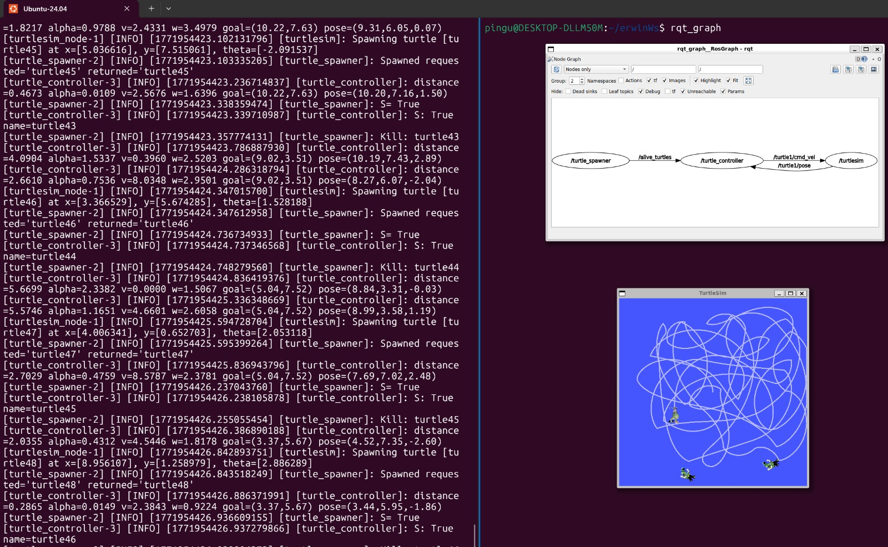

# ROS Basics Capstone – Turtlesim Catch Them All

## 1. Overview

The project is a multi-node ROS 2 application where:

- `turtlesim_node` provides the simulator and built-in services (`/spawn`, `/kill`)
- `turtle_spawner` spawns random turtles and manages the list of alive turtles
- `turtle_controller` controls `turtle1` to chase and catch turtles
- Custom interfaces are used to share alive turtle information and request a catch action

This report documents an implementation that was already completed, focusing on how each package, node, topic, and service contributes to the final behavior. The overall goal is to integrate ROS 2 basics (topics, services, custom interfaces, parameters, and launch files) in a single working application.

---

## 2. Project objective

Implement a ROS 2 system that repeatedly spawns turtles in `turtlesim` and makes `turtle1` chase them automatically until they are removed.

Main expected features (from the assignment instructions):
- Spawn turtles at random positions
- Publish a list of alive turtles
- Control `turtle1` using a feedback controller
- Request capture of a turtle through a custom service
- Use a launch file and YAML parameters to start the system

In practice, this capstone demonstrates a complete control loop:
1. Perception/state update (`/turtle1/pose`, `/alive_turtles`)
2. Decision (select nearest turtle)
3. Action (`/turtle1/cmd_vel`)
4. Task completion request (`/catch_turtle`)
5. Environment update (remove turtle and republish alive list)

---

## 3. System architecture

### Nodes
- `turtlesim_node` (from `turtlesim`)
- `turtle_spawner` (custom, package `er_turtle`)
- `turtle_controller` (custom, package `er_turtle`)

### Topics
- `/turtle1/pose` (subscribe in controller)
- `/turtle1/cmd_vel` (publish from controller)
- `/alive_turtles` (publish from spawner, subscribe in controller)

### Services
- `/spawn` (called by spawner)
- `/kill` (called by spawner)
- `/catch_turtle` (custom service offered by spawner, called by controller)

This architecture separates responsibilities clearly:
- `turtle_spawner` manages the "world state" of target turtles.
- `turtle_controller` manages motion control and pursuit behavior.
- `turtlesim_node` provides the simulation and native turtle management services.

This separation is aligned with the assignment intent: use ROS 2 communication primitives to coordinate independent nodes.

---

## 4. Custom interfaces package (`er_interfaces_turtle`)

This package defines the messages and service used by the controller and spawner.

Custom interfaces are required because the default ROS 2 and turtlesim interfaces do not provide:
- a compact list of all alive turtles with positions (`TurtleArray`)
- a custom "catch request" semantic (`CatchTurtle`)

### 4.1 `TurtleIn.msg`

Purpose:
- Represents a turtle entry in the alive list.
- Stores the turtle name and its spawn pose.

```text
string name
float32 x
float32 y
float32 theta
```

Explanation:
- `name`: turtle name (for example `turtle2`, `turtle3`, etc.)
- `x`, `y`: turtle position used when spawned
- `theta`: turtle heading used when spawned

This message is the basic unit used by the spawner to publish tracked turtles and by the controller to choose a target.

---

### 4.2 `TurtleArray.msg`

Purpose:
- Publishes all currently alive turtles in one message.

```text
TurtleIn[] turtles
```

Explanation:
- `turtles` is an array of `TurtleIn`
- This topic is published by `turtle_spawner` and read by `turtle_controller`

Using a single array message avoids publishing multiple topics or multiple services just to share the current list of targets. It also makes the controller logic simpler because it receives the full set of candidates in one callback.

---

### 4.3 `CatchTurtle.srv`

Purpose:
- Requests that one turtle be removed (caught) by name.

```text
string name
---
bool success
```

Explanation:
- Request:
  - `name`: the turtle to remove
- Response:
  - `success`: whether the request was accepted and processed

This service acts as the bridge between "controller reached target" and "spawner updates the alive list + kills turtle in turtlesim". It keeps the controller focused on motion and the spawner focused on entity management.

---

### 4.4 Notes on interface package build files

The interface package must use `rosidl_generate_interfaces(...)` in `CMakeLists.txt` and declare the correct dependencies in `package.xml` (`rosidl_default_generators`, `rosidl_default_runtime`, and `ament_cmake`).

The uploaded interface `package.xml` identifies the package as:

- `er_interfaces_turtle`

This matches the imports used in the Python nodes:
- `from er_interfaces_turtle.msg import ...`
- `from er_interfaces_turtle.srv import ...`

This consistency is important because any mismatch between package name, generated interfaces, and Python imports causes build/import errors.

---

## 5. Python nodes package (`er_turtle`)

This package contains the two custom nodes:
- `turtle_spawner`
- `turtle_controller`

It also includes `setup.py`/`setup.cfg` for registering executables.

Functionally, this package is where the runtime behavior of the capstone lives:
- one node manages target generation/removal
- the other node performs guidance and pursuit

---

## 5. `turtle_spawner.py` (Spawner + alive list manager + catch service server)

### 5.1 Role in the system

`MySpawner` is responsible for:
- Spawning turtles periodically at random positions using `/spawn`
- Keeping an internal list of alive turtles
- Publishing that list to `alive_turtles`
- Exposing `catch_turtle` service
- Calling `/kill` when a turtle must be removed

This node acts as the "world manager" for the capstone.

It centralizes the logical state of active targets so the controller does not need to know how turtles are created or removed internally.

---

### 5.2 Main ROS interfaces used by `turtle_spawner`

- Client: `spawn` (`turtlesim/srv/Spawn`)
- Client: `kill` (`turtlesim/srv/Kill`)
- Publisher: `alive_turtles` (`er_interfaces_turtle/msg/TurtleArray`)
- Service server: `catch_turtle` (`er_interfaces_turtle/srv/CatchTurtle`)

The node uses both ROS 2 service client and server roles:
- client role for interacting with `turtlesim`
- server role for receiving "catch" requests from the controller

This is one of the key integration points of the assignment.

---

### 5.3 Important implementation details

#### Parameters
The node declares and uses:
- `spawn_frequency` (default `1.25`)
- `turtle_name_prefix` (default `"turtle"`)

These are later configured in the bringup YAML file.

This allows the node behavior to be modified without changing code:
- faster/slower spawn rate
- different naming conventions

#### Internal state
- `cnt_name`: starts at `2` (because `turtle1` already exists in turtlesim)
- `alive_turtlesA`: stores the published alive turtle array

Starting at `2` is important because `turtlesim_node` creates `turtle1` automatically, and the spawned turtles are intended to be targets (`turtle2`, `turtle3`, ...).

#### Random spawning
The node generates:
- `x` in `[0.5, 10.5]`
- `y` in `[0.5, 10.5]`
- `theta` in `[-pi, pi]`

These ranges keep spawned turtles inside the visible map region and produce random headings for variety.

#### Catch service behavior
When `catch_turtle` is called:
- It calls `/kill` using the received turtle name
- Removes the turtle from the internal alive list
- Republishes the updated `alive_turtles` message

Republishing after removal is essential so the controller always works with the current list and can immediately choose a new nearest target.

---

### 5.5 Full code (`turtle_spawner.py`)

```python
#!/usr/bin/env python3

import numpy as np
import rclpy
import random
from rclpy.node import Node
from er_interfaces_turtle.msg import TurtleIn, TurtleArray
from er_interfaces_turtle.srv import CatchTurtle
from turtlesim.srv import Spawn, Kill
from functools import partial

class MySpawner(Node):
    def __init__(self):
        super().__init__("turtle_spawner") #Only identification          
        self.client = self.create_client(Spawn,"spawn") #Service type, Service name

        self.declare_parameter("spawn_frequency", 1.25) #Declare parameter
        self.spawn_frequency_ = self.get_parameter("spawn_frequency").value #Use the parameter
        self.create_timer(self.spawn_frequency_, self.t_spawner)

        self.declare_parameter("turtle_name_prefix", "turtle") #Declare parameter
        self.turtle_name_prefix_ = self.get_parameter("turtle_name_prefix").value #Use the parameter

        self.cnt_name = 2
        self.alive_turtlesA = TurtleArray()

        self.alive_turtles_ = self.create_publisher(TurtleArray, "alive_turtles", 10)
        self.catch_turtle_ = self.create_service(CatchTurtle, "catch_turtle", self.call_kill) #Service type, Service name, callback
        self.client2 = self.create_client(Kill, "kill") #Service type, Service name

    def call_spawn(self, save: TurtleIn):
        while not self.client.wait_for_service(timeout_sec=1.0):
            self.get_logger().info("Server not available")

        request = Spawn.Request()
        request.x = float(save.x)
        request.y = float(save.y)
        request.theta = float(save.theta)
        request.name = str(save.name)

        future = self.client.call_async(request)
        future.add_done_callback(partial(self.add_spawn, request, save))

    def add_spawn(self, request, save, future):
        try:
            response = future.result()
            save.name = response.name

            self.alive_turtlesA.turtles.append(save)
            self.alive_turtles_.publish(self.alive_turtlesA)

            self.get_logger().info(f"Spawned requested='{request.name}' returned='{response.name}'")

        except Exception as e:
            self.get_logger().error(f"Spawn failed for {request.name}: {e}")

    def t_spawner(self):
        save = TurtleIn()
        save.name = self.turtle_name_prefix_ + str(self.cnt_name)
        save.x = float(random.uniform(0.5, 10.5))
        save.y = float(random.uniform(0.5, 10.5))
        save.theta = float(random.uniform(-np.pi, np.pi))

        self.call_spawn(save)

        self.cnt_name += 1

    def kill_la_kill(self, name:str):
        while not self.client2.wait_for_service(timeout_sec=1.0):
            self.get_logger().info("Server not available")

        request = Kill.Request()
        request.name = name

        self.future = self.client2.call_async(request)
        self.future.add_done_callback(partial(self.add_kill, request))

    def add_kill(self, request: Kill.Request, future):
        try:
            future.result()

            if self.remove_alive_turtle(request.name):
                self.alive_turtles_.publish(self.alive_turtlesA)

            self.get_logger().info(f"Kill: {request.name}")
        except Exception as e:
            self.get_logger().error(f"Kill failed for {request.name}: {e}")

    def remove_alive_turtle(self, name: str):
        for i, t in enumerate(self.alive_turtlesA.turtles):
            if t.name == name:
                del self.alive_turtlesA.turtles[i]
                return True
        return False

    def call_kill(self, request: CatchTurtle.Request, response: CatchTurtle.Response):
        self.kill_la_kill(request.name)
        response.success = True
        self.get_logger().info(f"S= {response.success}")
        return response

def main(args=None):
    rclpy.init(args=args)   
    node = MySpawner()
    rclpy.spin(node) 
    rclpy.shutdown()

if __name__ == "__main__":  
    main()
```

---

## 6. `turtle_controller.py` (Chaser controller + catch service client)

### 6.1 Role in the system

`TurtlePointController`:
- Reads `turtle1` pose from `turtle1/pose`
- Reads alive turtles from `alive_turtles`
- Chooses the nearest turtle as target
- Computes control commands (`linear.x`, `angular.z`) to chase it
- Calls `catch_turtle` when the target is reached

This is the intelligent behavior node of the capstone.

Its main responsibility is not spawning or deleting turtles, but generating motion commands that make `turtle1` converge to the active target robustly and repeatedly.

---

### 6.2 Control strategy summary

The controller uses:

- A **discrete incremental PID** for linear speed (distance error)
- A **discrete incremental PID** for angular speed (heading error)
- Saturation/anti-windup-style clipping for command limits
- Angle wrapping to keep angular error in `[-pi, pi]`
- A cosine coupling term to reduce orbiting/loops

Control variables:
- Distance error: `distance = sqrt((gx-x)^2 + (gy-y)^2)`
- Angular error: `alpha = wrap_pi(goal_angle - theta)`

A goal is considered reached when:
- `distance <= pos_tol`

At that moment:
- The controller publishes zero velocity
- Resets PID memory
- Calls `catch_turtle` for the selected turtle name

This behavior matches the assignment goal of autonomous pursuit-and-catch using ROS communication and feedback control.

---

### 6.3 Discrete PID (incremental form) used in the code

The implementation is based on an incremental discrete PID form (as coded in `IncPid.step()`):

```text
u[k] = u[k-1] + q0*e[k] + q1*e[k-1] + q2*e[k-2]
```

Where:
- `u[k]` is the current control output
- `e[k]` is the current error
- `q0`, `q1`, `q2` are coefficients computed from continuous parameters (`kc`, `ti`, `td`) and sample time `Ts`

The code computes coefficients in `set_from_continuous(...)` and applies clipping with `clip_value(...)`.

In this implementation:
- one PID instance (`self.v_pid`) regulates the distance error and generates the linear speed reference
- another PID instance (`self.w_pid`) regulates the heading error and generates the angular speed command

Additionally, the linear command is multiplied by a cosine term based on `alpha`, which reduces forward motion when the turtle is not facing the target. This improves turning behavior and reduces circular trajectories around the goal.


---

### 6.4 Main tuning/limits in the uploaded implementation

- Sample time: `Ts = 0.05 s`
- Position tolerance: `0.275`
- Linear command limits: `[-12.0, 12.0]`
- Angular command limits: `[-7.5, 7.5]`

Tuned PID values used in code:
- Linear PID: `kc=2.25`, `ti=0.985`, `td=0.0275`
- Angular PID: `kc=3.6`, `ti=0.65`, `td=0.0245`

These values define the response speed and smoothness of the pursuit behavior. The command limits are especially important in `turtlesim` to prevent excessive velocities that could make the trajectory unstable or visually erratic.

---

### 6.6 Full code (`turtle_controller.py`)

```python
#!/usr/bin/env python3

import numpy as np
import rclpy
from rclpy.node import Node
from geometry_msgs.msg import Twist
from turtlesim.msg import Pose
from er_interfaces_turtle.msg import TurtleArray
from er_interfaces_turtle.srv import CatchTurtle
from functools import partial

#Anti-windup/limits
def clip_value(x, xmin, xmax):
    return float(np.clip(x, xmin, xmax))

#Wrap for fast response
def wrap_pi(angle):
    return float((angle + np.pi) % (2.0 * np.pi) - np.pi)

class IncPid:
    def __init__(self, ts, umin, umax):
        self.ts = ts
        self.umin = umin
        self.umax = umax

        #Sample important states
        self.e1 = 0.0   # e[k-1]
        self.e2 = 0.0   # e[k-2]
        self.u1 = 0.0   # u[k-1]

        #Discrete coefficients
        self.q0 = 0.0
        self.q1 = 0.0
        self.q2 = 0.0

    def set_from_continuous(self, kc, ti=None, td=0.0):
        Ts = self.ts

        i_term = 0.0
        if ti is not None and ti > 0.0:
            i_term = Ts / (2.0 * ti)

        d_term = 0.0
        if td > 0.0:
            d_term = td / Ts

        #Incremental PID coefficient (discrete)
        self.q0 = kc * (1.0 + i_term + d_term)
        self.q1 = -kc * (1.0 - i_term + 2.0 * d_term)
        self.q2 = kc * d_term

    def reset(self, u0=0.0):
        self.e1 = 0.0
        self.e2 = 0.0
        self.u1 = clip_value(u0, self.umin, self.umax)

    def step(self, e):
        u = self.u1 + self.q0 * e + self.q1 * self.e1 + self.q2 * self.e2
        u = clip_value(u, self.umin, self.umax)

        #Update past
        self.e2 = self.e1
        self.e1 = e
        self.u1 = u

        return float(u)

class TurtlePointController(Node):
    def __init__(self):
        super().__init__("turtle_controller")

        # ===== Sample time =====
        self.ts = 0.05

        # ===== Tolerances =====
        self.pos_tol = 0.275
        self.allow_reverse = False #My experiment, it is good for slow responses (kinda funny)

        # ===== Command limits =====
        self.v_min = -12.0
        self.v_max =  12.0
        self.w_min = -7.5
        self.w_max =  7.5

        # ===== Linear PID (distance) =====
        self.v_pid = IncPid(ts=self.ts, umin=self.v_min, umax=self.v_max)
        self.v_pid.set_from_continuous(kc=2.25, ti=0.985, td=0.0275)

        # ===== Angular PID (alpha) =====
        self.w_pid = IncPid(ts=self.ts, umin=self.w_min, umax=self.w_max)
        self.w_pid.set_from_continuous(kc=3.6, ti=0.65, td=0.0245)

        # ===== Current pose =====
        self.x = 0.0
        self.y = 0.0
        self.theta = 0.0
        self.pose_ok = False #Not necessary but just to be sure

        # ===== Goal point =====
        self.gx = 5.4444
        self.gy = 5.4444
        self.goal_ok = False #Not necessary but just to be sure
        self.last_goal = (self.gx, self.gy)

        # ===== Current errors =====
        self.distance = 0.0 #Distance error
        self.alpha = 0.0 #Orientation error

        # ===== NAME =====
        self.name_kill = ""

        # ===== ROS interfaces =====
        self.cmd_pub = self.create_publisher(Twist, "turtle1/cmd_vel", 10)
        self.create_timer(self.ts, self.control_step)        

        self.create_subscription(Pose, "turtle1/pose", self.pose_cb, 10)
        self.create_subscription(TurtleArray, "alive_turtles", self.goal_cb, 10) #Will be modified

        self.client = self.create_client(CatchTurtle,"catch_turtle")
        self.last_kill = ""

        self.log_counter = 0
        self.get_logger().info("turtle_controller is alive")


    def callKILL(self, name: str):
        while not self.client.wait_for_service(timeout_sec = 1.0):
            self.get_logger().info("Server not available")

        request = CatchTurtle.Request()
        request.name = name

        self.future = self.client.call_async(request)   #asyncronous request
        self.future.add_done_callback(partial(self.add_callKILL, request))

    def add_callKILL(self, request: CatchTurtle.Request, future):
        response = future.result()
        self.get_logger().info(f"S: {response.success} name={request.name}")


    def pose_cb(self, msg: Pose):
        self.x = float(msg.x)
        self.y = float(msg.y)
        self.theta = float(msg.theta)
        self.pose_ok = True

    def goal_cb(self, msg: TurtleArray):
        #No turtles
        if not msg.turtles:
            return

        #Just in case, autodestruction
        if not self.pose_ok:
            return

        nearest = min(msg.turtles, key=lambda t: (float(t.x) - self.x) ** 2 + (float(t.y) - self.y) ** 2)

        self.name_kill = nearest.name
        new_goal = (float(nearest.x), float(nearest.y))
        self.gx, self.gy = new_goal
        self.goal_ok = True

        #Reset PID memory if goal changed noticeably (fast response)
        dx = new_goal[0] - self.last_goal[0]
        dy = new_goal[1] - self.last_goal[1]
        if float(np.hypot(dx, dy)) > 0.05:
            self.v_pid.reset()
            self.w_pid.reset()

        self.last_goal = new_goal

    def update_errors(self):
        dx = self.gx - self.x
        dy = self.gy - self.y

        self.distance = float(np.hypot(dx, dy))

        if self.distance <= self.pos_tol:
            self.alpha = 0.0
            return

        goal_angle = float(np.arctan2(dy, dx))
        self.alpha = wrap_pi(goal_angle - self.theta)

    def publish_stop(self):
        msg = Twist()
        msg.linear.x = 0.0
        msg.angular.z = 0.0
        self.cmd_pub.publish(msg)

    def control_step(self):
        if not self.pose_ok or not self.goal_ok:
            return

        self.update_errors()

        #Stop condition (point reached)
        if self.distance <= self.pos_tol:
            self.publish_stop()
            self.v_pid.reset()
            self.w_pid.reset()
            if self.last_kill != self.name_kill:
                self.callKILL(self.name_kill)
                self.last_kill = self.name_kill
            return

        #Angular command
        w_cmd = self.w_pid.step(self.alpha)

        #Linear command from distance PID
        v_pid_out = self.v_pid.step(self.distance)

        #Coupling to reduce loops/orbits:
        #linear speed decreases if heading error is large
        c = float(np.cos(self.alpha))
        if self.allow_reverse:
            v_cmd = v_pid_out * c
        else:
            v_cmd = v_pid_out * max(0.0, c)

        # Final clamp (after coupling)
        v_cmd = clip_value(v_cmd, self.v_min, self.v_max)
        w_cmd = clip_value(w_cmd, self.w_min, self.w_max)

        # Publish
        msg = Twist()
        msg.linear.x = float(v_cmd)
        msg.angular.z = float(w_cmd)
        self.cmd_pub.publish(msg)

        # Debug (every ~0.5 s)
        self.log_counter += 1
        if self.log_counter % 10 == 0:
            self.get_logger().info(
                f"distance={self.distance:.4f} alpha={self.alpha:.4f} "
                f"v={v_cmd:.4f} w={w_cmd:.4f} "
                f"goal=({self.gx:.2f},{self.gy:.2f}) "
                f"pose=({self.x:.2f},{self.y:.2f},{self.theta:.2f})"
            )

def main(args=None):
    rclpy.init(args=args)
    node = TurtlePointController()
    rclpy.spin(node)
    rclpy.shutdown()


if __name__ == "__main__":
    main()
```

---

## 7. `setup.py` and `setup.cfg` (Python package registration)

### 7.1 Purpose

These files register the executable entry points so ROS 2 can run the Python nodes using:

- `ros2 run er_turtle turtle_spawner`
- `ros2 run er_turtle turtle_controller`

This is required for `ament_python` packages because ROS 2 resolves executable names through the `console_scripts` declared in `setup.py`.

### 7.2 `setup.py` (uploaded)

```python
from setuptools import find_packages, setup

package_name = 'er_turtle'

setup(
    name=package_name,
    version='0.0.0',
    packages=find_packages(exclude=['test']),
    data_files=[
        ('share/ament_index/resource_index/packages',
            ['resource/' + package_name]),
        ('share/' + package_name, ['package.xml']),
    ],
    install_requires=['setuptools'],
    zip_safe=True,
    maintainer='pingu',
    maintainer_email='pingu@todo.todo',
    description='TODO: Package description',
    license='TODO: License declaration',
    extras_require={
        'test': [
            'pytest',
        ],
    },
    entry_points={
        'console_scripts': [
            'turtle_controller2 = er_turtle.turtle_controller2:main',
            'turtle_controller = er_turtle.turtle_controller:main',
            'turtle_spawner = er_turtle.turtle_spawner:main'
        ],
    },
)
```

### 7.3 `setup.cfg` (uploaded)

```ini
[develop]
script_dir=$base/lib/er_turtle
[install]
install_scripts=$base/lib/er_turtle
```

### 7.4 Notes
- The uploaded `setup.py` includes an extra entry point:
  - `turtle_controller2 = er_turtle.turtle_controller2:main`
- If `turtle_controller2.py` does not exist, that entry point should be removed to avoid runtime errors.

For the capstone workflow, the important part is that `turtle_spawner` and `turtle_controller` are correctly registered, since both are referenced by the launch file.

---

## 8. Bringup package (`turtle_bringup`)

The bringup package starts the complete application and provides parameters for `turtle_spawner`.

Using a dedicated bringup package is good practice because it keeps:
- executable node code in one package (`er_turtle`)
- custom interfaces in another (`er_interfaces_turtle`)
- system startup/configuration files in a separate package (`turtle_bringup`)

This improves organization and makes the system easier to reuse and test.

---

### 8.1 Launch file (`app_launch_turtle.xml`)

Purpose:
- Starts `turtlesim_node`
- Starts `turtle_spawner` and loads parameters from YAML
- Starts `turtle_controller`

This file is the entry point for running the full demo in one command, which is one of the key expected outcomes of the capstone.

```xml
<launch>
    <node pkg="turtlesim" exec="turtlesim_node" />
    <node pkg="er_turtle" exec="turtle_spawner">
        <param from="$(find-pkg-share turtle_bringup)/config/t_param.yaml" />
    </node>
    <node pkg="er_turtle" exec="turtle_controller" />
</launch>
```

---

### 8.2 Parameter file (`t_param.yaml`)

Purpose:
- Configures `turtle_spawner` parameters from a centralized YAML file

```yaml
turtle_spawner:
    ros__parameters:
        spawn_frequency: 1.25
        turtle_name_prefix: "turtle"
```

Explanation:
- `spawn_frequency`: timer period in seconds for spawning new turtles
- `turtle_name_prefix`: prefix for generated names (`turtle2`, `turtle3`, ...)

This keeps runtime tuning outside the source code and matches the assignment requirement of using parameters in a realistic ROS 2 setup.

---

### 8.3 Bringup `CMakeLists.txt` (uploaded)

Purpose:
- Installs the `launch/` and `config/` directories into the package share directory

This installation step is necessary so ROS 2 can find:
- `app_launch_turtle.xml`
- `t_param.yaml`

when executing `ros2 launch turtle_bringup app_launch_turtle.xml`.

```cmake
cmake_minimum_required(VERSION 3.8)
project(turtle_bringup)

if(CMAKE_COMPILER_IS_GNUCXX OR CMAKE_CXX_COMPILER_ID MATCHES "Clang")
  add_compile_options(-Wall -Wextra -Wpedantic)
endif()

find_package(ament_cmake REQUIRED)

install(DIRECTORY
  launch
  config
  DESTINATION share/${PROJECT_NAME}/
)

ament_package()
```

---

## 9. How the full flow works (step-by-step)

1. `app_launch_turtle.xml` starts `turtlesim_node`, `turtle_spawner`, and `turtle_controller`.
2. `turtle_spawner` uses the YAML parameters to set spawn period and name prefix.
3. `turtle_spawner` periodically calls `/spawn` with random `(x, y, theta)`.
4. Every successful spawn is added to the internal `alive_turtles` list and published.
5. `turtle_controller` receives `/alive_turtles`, selects the nearest turtle as current target.
6. `turtle_controller` reads `/turtle1/pose` and computes velocity commands using the discrete PID logic.
7. When `turtle1` reaches the target (inside `pos_tol`), `turtle_controller` calls `catch_turtle`.
8. `turtle_spawner` receives `catch_turtle`, calls `/kill`, removes the turtle from the alive list, and republishes the updated list.
9. The process repeats as new turtles continue spawning.

This sequence directly reflects the intended integration of topics + services + custom interfaces described in the activity.

---

## 10. Useful commands (from assignment workflow)

### 10.1 Type inspection

```bash
ros2 topic list -t
ros2 service list -t
ros2 action list -t
```

These commands help verify that:
- the expected topics/services exist
- the interface types match the implementation

### 10.2 Interface structure inspection

```bash
ros2 interface show er_interfaces_turtle/msg/TurtleIn
ros2 interface show er_interfaces_turtle/msg/TurtleArray
ros2 interface show er_interfaces_turtle/srv/CatchTurtle
ros2 interface show turtlesim/srv/Spawn
ros2 interface show turtlesim/srv/Kill
```

These commands are especially useful during documentation and debugging because they confirm the exact fields used by the messages/services.

### 10.3 Verbose connection info

```bash
ros2 topic info /alive_turtles -v
ros2 topic info /turtle1/pose -v
ros2 topic info /turtle1/cmd_vel -v
ros2 service info /catch_turtle -v
ros2 service info /spawn -v
ros2 service info /kill -v
```

Use these commands to validate publishers/subscribers and service clients/servers, which is very helpful to demonstrate that the final graph matches the project architecture.

---

## 11. Terminal and results

Video of each node working toguether
[Demo video](recursos/imgs/Act_turtle/resultado.mp4)

Image of launch .xml file result
