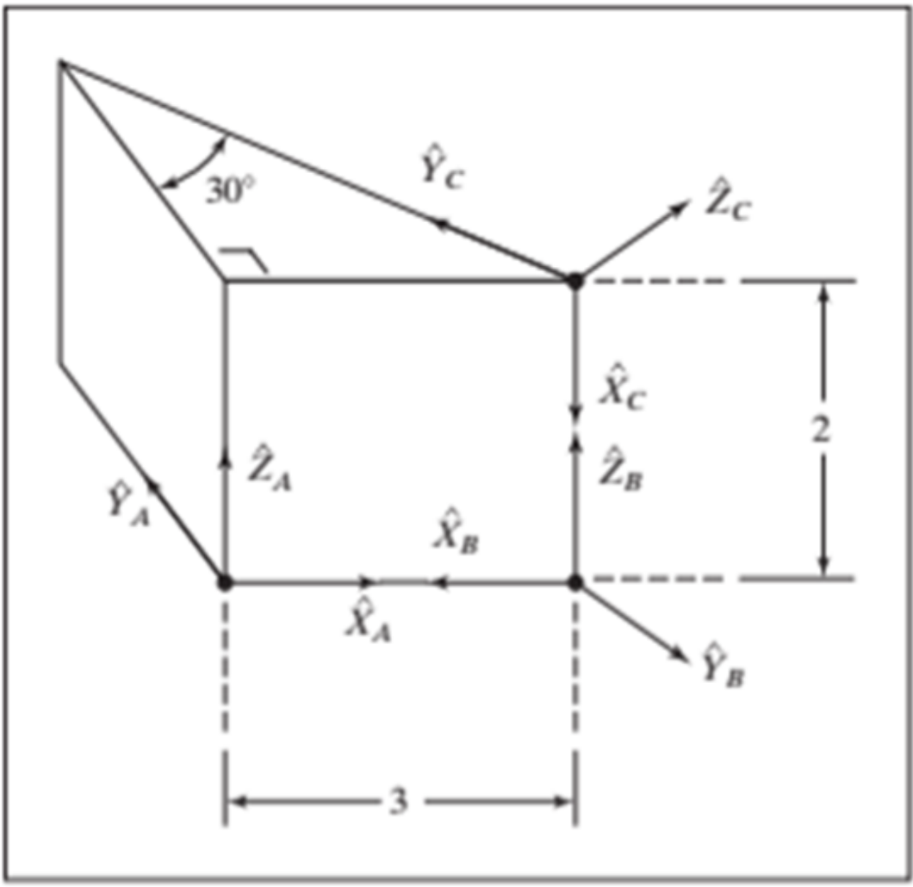

# Homework 2: Transform Nomenclature

## Excersice 1

The problem applies two **active rotations** to the vector \(^{A}\mathbf{P}\). The rotations are executed **in the indicated order**:

1. Rotate about the axis \(\hat{\mathbf{Y}}_{A}\) by \(45^\circ\)
2. Then rotate about the axis \(\hat{\mathbf{X}}_{A}\) by \(60^\circ\)

Mathematically:

$$
\mathbf{P}_T=\mathbf{R}_y(\theta)\,\mathbf{R}_x(\alpha)\,^{A}\mathbf{P}
$$

Where:

$$
\mathbf{P}_T=
\begin{bmatrix}
\mathbf{P}_{Tx} \\
\mathbf{P}_{Ty} \\
\mathbf{P}_{Tz}
\end{bmatrix}
\hspace{1.5cm}
^{A}\mathbf{P}=
\begin{bmatrix}
\mathbf{P}_{Ax} \\
\mathbf{P}_{Ay} \\
\mathbf{P}_{Az}
\end{bmatrix}
$$

Rotation about **Y** by \(45^\circ\) and rotation about **X** by \(60^\circ\):

$$
\mathbf{R}_y(45^\circ)=
\begin{bmatrix}
\cos 45^\circ & 0 & \sin 45^\circ\\
0 & 1 & 0\\
-\sin 45^\circ & 0 & \cos 45^\circ
\end{bmatrix}
\;\;\;\;
\mathbf{R}_x(60^\circ)=
\begin{bmatrix}
1 & 0 & 0\\
0 & \cos 60^\circ & -\sin 60^\circ\\
0 & \sin 60^\circ & \cos 60^\circ
\end{bmatrix}
$$

Simplifing in one general rotation matriz

$$
\mathbf{R}=\mathbf{R}_y(45^\circ)\,\mathbf{R}_x(60^\circ)
$$

Numeric result:

$$
\mathbf{R}=
\begin{bmatrix}
0.7071 & 0.6124 & 0.3536 \\
0 & 0.5 & -0.866 \\
-0.7071 & 0.6124 & 0.3536
\end{bmatrix}
$$

---

## Exercise 2

In this exercise, the frame \(\{B\}\) is defined with respect to \(\{A\}\) by:

- A rotation about the axis \(\hat{\mathbf{X}}_{A}\) of \(30^\circ\)

$$
\mathbf{R}_x(30^\circ)=
\begin{bmatrix}
1 & 0 & 0\\
0 & \cos 30^\circ & -\sin 30^\circ\\
0 & \sin 30^\circ & \cos 30^\circ
\end{bmatrix}
$$

- A translation of \(\{B\}\) from \(\{A\}\) given by:

$$
^{A}_{B}\mathbf{t}=
\begin{bmatrix}
5\\
10\\
0
\end{bmatrix}
$$

A homogeneous transformation matrix is built by placing the rotation matrix and translation vector in block form:

$$
^{A}_{B}\mathbf{T}=
\begin{bmatrix}
^{A}_{B}\mathbf{R} & ^{A}_{B}\mathbf{t}\\
0 & 1
\end{bmatrix}
$$

For this case, \(^{A}_{B}\mathbf{R}=\mathbf{R}_x(30^\circ)\) and \(^{A}_{B}\mathbf{t}=[5\;\;10\;\;0]^{\mathsf{T}}\), therefore:

$$
^{A}_{B}\mathbf{T}=
\begin{bmatrix}
1 & 0 & 0 & 5\\
0 & \cos 30^\circ & -\sin 30^\circ & 10\\
0 & \sin 30^\circ & \cos 30^\circ & 0\\
0 & 0 & 0 & 1
\end{bmatrix}=
\begin{bmatrix}
1 & 0 & 0 & 5\\
0 & 0.866 & -0.5 & 10\\
0 & 0.5 & 0.866 & 0\\
0 & 0 & 0 & 1
\end{bmatrix}
$$

This means that the **pose** of frame \(\{B\}\) with respect to frame \(\{A\}\) is:

$$
^{A}_{B}\mathbf{P} = ^{A}_{B}\mathbf{T}\;\mathbf{P}_{A}
$$

---

## Exercise 3

  

This exercise is divided into two parts:

1. A translation and rotation from point \(\mathbf{A}\) to point \(\mathbf{B}\)
2. A translation and rotation from point \(\mathbf{A}\) to point \(\mathbf{C}\)

**Definition of homogeneous transformation matrix (from A to B)**

The homogeneous transformation matrix is equivalent to translating 3 units along the \(\hat{\mathbf{X}}_{A}\) axis and then applying a 180° rotation around the \(\hat{\mathbf{Z}}_{A}\) axis. Mathematically, this is:

$$
^{B}_{A}\mathbf{T}=
\begin{bmatrix}
1 & 0 & 0 & 3\\
0 & 1 & 0 & 0\\
0 & 0 & 1 & 0\\
0 & 0 & 0 & 1
\end{bmatrix}
\begin{bmatrix}
\cos 180^\circ & -\sin 180^\circ & 0 & 0\\
\sin 180^\circ & \cos 180^\circ & 0 & 0\\
0 & 0 & 1 & 0\\
0 & 0 & 0 & 1
\end{bmatrix}=
\begin{bmatrix}
-1 & 0 & 0 & 3\\
0 & -1 & 0 & 0\\
0 & 0 & 1 & 0\\
0 & 0 & 0 & 1
\end{bmatrix}
$$

**Definition of homogeneous transformation matrix (from A to C)**

The homogeneous transformation matrix is equivalent to translating 3 units along the \(\hat{\mathbf{X}}_{A}\) and 2 units along the \(\hat{\mathbf{Z}}_{A}\) axis. Then applying a 90° rotation around the \(\hat{\mathbf{Y}}_{A}\) axis and finally a -30° rotation around the \(\hat{\mathbf{X}}_{A}\).Mathematically, this is:

$$
^{C}_{A}\mathbf{T}=
\begin{bmatrix}
1 & 0 & 0 & 3\\
0 & 1 & 0 & 0\\
0 & 0 & 1 & 2\\
0 & 0 & 0 & 1
\end{bmatrix}
\begin{bmatrix}
\cos 90^\circ & 0 & \sin 90^\circ & 0\\
0 & 1 & 0 & 0\\
-\sin 90^\circ & 0 & \cos 90^\circ & 0\\
0 & 0 & 0 & 1
\end{bmatrix}
\begin{bmatrix}
1 & 0 & 0 & 0\\
0 & \cos -30^\circ & -\sin -30^\circ  & 0\\
0 & -\sin -30^\circ  & \cos -30^\circ & 0\\
0 & 0 & 0 & 1
\end{bmatrix}
$$

Simplifying:

$$
^{C}_{A}\mathbf{T}=
\begin{bmatrix}
0 & -0.5 & 0.866 & 3\\
0 & 0.866 & 0.5 & 0\\
-1 & 0 & 0 & 2\\
0 & 0 & 0 & 1
\end{bmatrix}
$$