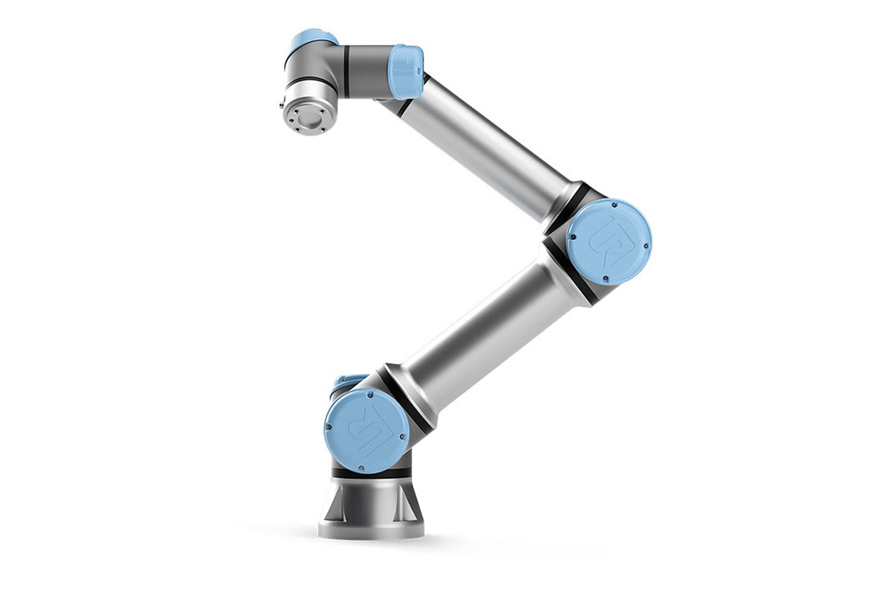
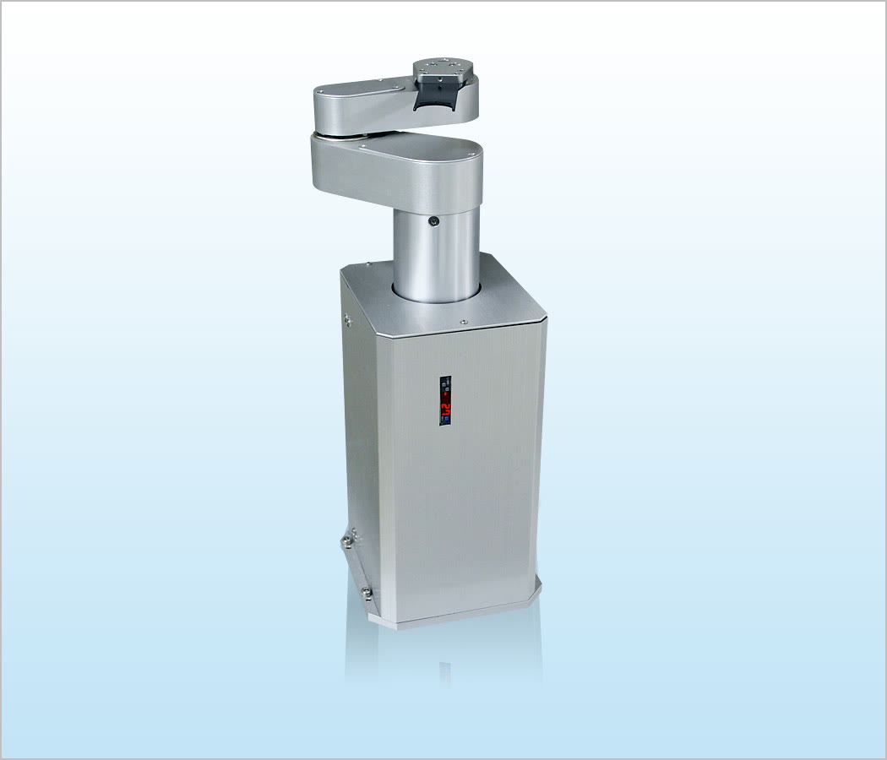

# Homework 1: Examples of robots by morphology

## Cartesian (PPP)

**Güdel gantryRobot**

*A modular cartesian industrial robot for high-accuracy handling integrated into automation cells. Widely used in industries like automotive and intralogistics.*

- **Advantages**
    * Very high stiffness and repeatability.
    * Large rectangular workspace and easy to scale.
- **Disadvantages**
    * Big structure, therefore, can be heavy and expensive at large spans.
    * Cable management and moving mass on long axes can limit dynamics.

-----------------
## SCARA (RRP)

**OMRON eCobra**

*A 4-axis industrial robot launched in 2016 and used nowadays for high-precision automation, including electronics and pharmaceutical-oriented environments.*

- **Advantages**
    * High speed with good repeatability (planar motion is very efficient).
    * High stiffness in the vertical axis (good for “downward” interactions).
- **Disadvantages**
    * Limited orientation capability (mainly about Z).
    * Not as flexible as other articulated robots for awkward poses (the workspace is a toroid).

-----------------
## Articulated (RRR)

**Universal Robots UR5e**

*A 6-axis collaborative robot introduced in 2018. It has integrated torque sensor for compliant interaction.*

- **dvantages**
    * Highest dexterity (reach around obstacles).
    * Adaptable to various geometric spaces.
- **Disadvantages**
    * More complex kinematics and calibration.
    * Joint limits are a real planning constraint.
    * Often slower and less stiff than PPP/SCARA.

-----------------
## Spherical / Polar (RRP)

*Chamoy*

- **Advantages**
    * Fewer joints while still covering many directions.
    * It can be mechanically simple for certain radial/angular motions.
- **Disadvantages**
    * Accuracy and stiffness vary with radius.
    * More awkward to fit into rectangular workcells.
    * Not as common today.

-----------------
## Cylindrical (RPP)

**JEL MCR3160C**

*A 3-axis clean robot designed for wafer handling in semiconductor production/inspection lines.*

- **Advantages**
    * Simple and with robust kinematics.
    * Often clean cable routes (axis separation is mechanically clear).
- **Disadvantages**
    * Limited dexterity/orientation.

-----------------
## Delta (Parallel)

**ABB IRB 360 FlexPicker**

*Parallel robot optimized for high-speed picking and packing introduced in 2008.*

- **Advantages**
    * Mechanically efficient for rapid point-to-point motion.
    * High repeatability in a defined “dome-like” workspace.
- **Disadvantages**
    * Not ideal for long-reach or heavy payload relative to size.
    * Limited workspace volume and orientation.

## Resources

??? info "Bibliography"
    [1] Texas Instruments, “*An engineer’s guide to industrial robot designs*,” Texas Instruments, PDF. Accessed: Jan. 27, 2026. [Online]. Available: https://www.ti.com/lit/eb/ssiy006/ssiy006.pdf

    [2] Güdel Group, “Gantry robots (gantryRobot),” *gudel.com*. Accessed: Jan. 27, 2026. [Online]. Available: https://www.gudel.com/products/robots/gantry-robot

    [3] OMRON Robotics, “eCobra SCARA Robot for Precision & Speed,” *robotics.omron.com*. Accessed: Jan. 27, 2026. [Online]. Available: https://robotics.omron.com/products/industrial-robots/scara/ecobra/

    [4] Universal Robots, “UR5e e-Series datasheet,” Universal Robots, PDF. Accessed: Jan. 27, 2026. [Online]. Available: https://www.universal-robots.com/media/1807465/ur5e_e-series_datasheets_web.pdf

    [5] A. G. Reiss, “Key factors used to classify industrial robots,” *DigiKey*, Apr. 16, 2024. Accessed: Jan. 27, 2026. [Online]. Available: https://www.digikey.com/en/articles/what-are-the-key-factors-used-to-classify-industrial-robots

    [6] JEL Corporation, “Products | MCR3160C | Wafer Transfer Atmospheric Robot,” *jel-robot.com*. Accessed: Jan. 27, 2026. [Online]. Available: https://www.jel-robot.com/products/MCR3160C.html

    [7] ABB, “IRB 360 FlexPicker® — Greater flexibility in a compact footprint,” ABB Robotics, Brochure ROB0082EN_G, PDF. Accessed: Jan. 27, 2026. [Online]. Available: https://search.abb.com/library/Download.aspx?DocumentID=ROB0082EN_G
