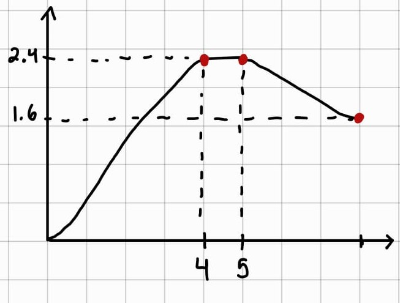

# (HW4) Homework 4: Trajectory Planning

## Exercise 1

This exercise gives a **position graph** \(q(t)\). The objective is to identify where the velocity is zero, where the velocity is maximum, and where the acceleration is positive or negative.

Mathematically, the solution is based on:

$$
\dot{q}(t)=\frac{dq(t)}{dt}
\qquad\qquad
\ddot{q}(t)=\frac{d^2q(t)}{dt^2}
$$

So:

- **Velocity** is the slope of the position graph
- **Acceleration** tells us how that slope changes

  

From the graph:

- The **velocity is zero** where the position graph is flat. This happens approximately:

    - From \(t=0 s\) to \(t=0.5\) s. Which is where point A is located.
    - From \(t\approx 4.5 s\) to \(t\approx 5.5\) s. Which is where point E is located.
    - From \(t\approx 7 s\) to \(t=8\) s. Which is where point F is located.

- The **maximum velocity** occurs where the graph has the **largest positive slope**. This is around **point C**, in the steep rising segment. Around **point F**, the slope is negative, but it isn't as steep as at point C.

- The **acceleration is positive** where the slope is increasing. This happens around **point B**, where the curve is concave upward. On the other hand, the **acceleration is negative** where the slope is decreasing. This happens around **point D**, where the curve bends and becomes flat.

---

## Exercise 2

This exercise gives a **trapezoidal velocity profile**. The objective is to compute the total displacement from the **area under the velocity curve**.

  

The graph can be divided into:

1. A left triangle
2. A rectangle
3. A right triangle

So:

$$
\Delta q = A_1 + A_2 + A_3
$$

Where:

$$
A_1=\frac{1}{2}(0.5)(0.8)=0.2
$$

$$
A_2=(2.0)(0.8)=1.6
$$

$$
A_3=\frac{1}{2}(0.5)(0.8)=0.2
$$

Then:

$$
\Delta q = 0.2 + 1.6 + 0.2 = 2.0 \text{ rad}
$$

Therefore, the **total displacement** is:

$$
\Delta q = 2.0 \text{ rad}
$$

As a compact check, using the trapezoidal area formula:

$$
\Delta q = v_{max}(t_a+t_c)=0.8(0.5+2.0)=2.0 \text{ rad}
$$

---

## Exercise 3

This exercise asks to determine whether the motion is **trapezoidal** or **triangular**.

The criterion is:

$$
\Delta q < \frac{v_{max}^2}{a_{max}}
\quad \Rightarrow \quad
\text{triangular profile}
$$

Otherwise, the motion is trapezoidal.

### Case a

Given:

$$
\Delta q = 5 \text{ rad}, \qquad v_{max}=2 \text{ rad/s}, \qquad a_{max}=4 \text{ rad/s}^2
$$

First compute the limit:

$$
\frac{v_{max}^2}{a_{max}}=\frac{2^2}{4}=\frac{4}{4}=1 \text{ rad}
$$

Compare:

$$
5 \nless 1
$$

Therefore, the motion is **trapezoidal**.

### Case b

Given:

$$
\Delta q = 0.4 \text{ rad}, \qquad v_{max}=2 \text{ rad/s}, \qquad a_{max}=4 \text{ rad/s}^2
$$

The limit is the same as case a, so:

$$
0.4 < 1
$$

Therefore, the motion is **triangular**.

---

## Exercise 4

This exercise gives a **velocity graph** and asks to sketch the corresponding **position graph** \(q(t)\), assuming \(q(0)=0\).

The position is obtained by integrating velocity:

$$
q(t)=q_0+\int_0^t \dot{q}(\tau)\,d\tau
$$

  

An approximate form of the curve may be obtained by integrating the velocity profile conceptually, leading to the graph shown below:

It can be described this way because, based on the velocity graph, we know that:

- From \(0\) to \(4\) s, the position **increases**
- From \(4\) to \(5\) s, the position remains **constant**
- From \(5\) to \(8\) s, the position **decreases**

The time coordinates on the x-axis can be estimated from the interval endpoints, while the corresponding position values on the y-axis can be approximated by computing the area under the described curve.

---

## Exercise 5

A joint must move:

$$
\Delta q = 2 \text{ rad}, \qquad v_{max}=1 \text{ rad/s}, \qquad a_{max}=4 \text{ rad/s}^2
$$

### a) Determine whether the motion is trapezoidal or triangular

Use the condition:

$$
\Delta q < \frac{v_{max}^2}{a_{max}}
\quad \Rightarrow \quad
\text{triangular profile}
$$

$$
\frac{v_{max}^2}{a_{max}}=\frac{1^2}{4}=0.25 \text{ rad}
$$

Since:

$$
2 \nless 0.25
$$

the motion then is **trapezoidal**.

### b) Compute \(t_a\), \(t_c\), and \(T\)

Acceleration time:

$$
t_a=\frac{v_{max}}{a_{max}}=\frac{1}{4}=0.25 \text{ s}
$$

Cruise time:

$$
t_c=\frac{\Delta q}{v_{max}}-t_a=\frac{2}{1}-0.25=1.75 \text{ s}
$$

Total time:

$$
T=2t_a+t_c=2(0.25)+1.75=2.25 \text{ s}
$$

Therefore:

$$
t_a=0.25 \text{ s}, \qquad t_c=1.75 \text{ s}, \qquad T=2.25 \text{ s}
$$

### c) Write the velocity function \(\dot{q}(t)\)

The velocity profile is defined in three stages:

1. A linear acceleration from rest up to the maximum velocity
2. A constant-velocity interval
3. A linear deceleration until the velocity returns to zero

Thus, the three phases are:

- Acceleration: \(0 \le t \le 0.25\)

$$
\dot{q}(t)=a_{max}t
\qquad\text{with}\qquad
t_a=\frac{v_{max}}{a_{max}}
$$

- Constant velocity: \(0.25 \le t \le 2.0\)

$$
\dot{q}(t)=v_{max}
$$

- Deceleration: \(2.0 \le t \le 2.25\)

$$
\dot{q}(t)=v_{max}-a_{max}(t-t_a-t_c)
$$

Substituting these values into the corresponding equations, the velocity profile is:

$$
\dot{q}(t)=
\begin{cases}
4t, & 0 \le t \le 0.25 \\[4pt]
1, & 0.25 \le t \le 2.0 \\[4pt]
1-4(t-2.0), & 2.0 \le t \le 2.25
\end{cases}
$$

### d) Write the position function \(q(t)\), assuming \(q_0=0\)

Integrating the velocity function in each interval gives the corresponding position function. Since \(q(0)=0\), the integration is performed phase by phase while preserving continuity between intervals.

$$
q(t)=\int 4t \, dt = 2t^2
\qquad\text{for}\qquad
0 \le t \le 0.25
$$

Evaluating at \(t=0.25\):

$$
q(0.25)=2(0.25)^2=0.125
$$

For the second phase, the motion starts from \(q(0.25)=0.125\), therefore:

$$
q(t)=0.125+\int_{0.25}^{t} 1 \, dt
=0.125+(t-0.25)
\qquad\text{for}\qquad
0.25 \le t \le 2.0
$$

Evaluating at \(t=2.0\):

$$
q(2.0)=0.125+(2.0-0.25)=1.875
$$

For the third phase, the motion starts from \(q(2.0)=1.875\), thus:

$$
q(t)=1.875+\int_{2.0}^{t}\left[1-4(t-2.0)\right] dt
$$

$$
q(t)=1.875+(t-2.0)-2(t-2.0)^2
\qquad\text{for}\qquad
2.0 \le t \le 2.25
$$

Therefore, the position profile is:

$$
q(t)=
\begin{cases}
2t^2, & 0 \le t \le 0.25 \\[6pt]
0.125 + (t-0.25), & 0.25 \le t \le 2.0 \\[6pt]
1.875 + (t-2.0) - 2(t-2.0)^2, & 2.0 \le t \le 2.25
\end{cases}
$$

---

## Exercise 6

A joint must move:

$$
\Delta q = 3 \text{ rad}
\qquad\text{in exactly}\qquad
T = 3 \text{ s}
$$

### a) Design a triangular velocity profile

For a triangular profile, displacement is the area of the triangle:

$$
\Delta q=\frac{1}{2}Tv_p
$$

Solving for the peak velocity:

$$
v_p=\frac{2\Delta q}{T}=\frac{2(3)}{3}=2 \text{ rad/s}
$$

Since the motion is symmetric, acceleration lasts half the total time:

$$
\frac{T}{2}=1.5 \text{ s}
$$

Then the required acceleration is:

$$
a=\frac{v_p}{T/2}=\frac{2}{1.5}=\frac{4}{3}\approx 1.333 \text{ rad/s}^2
$$

Therefore, for the triangular profile:

$$
v_p=2 \text{ rad/s}
\qquad\qquad
a=\frac{4}{3}\text{ rad/s}^2
$$

### b) Design a trapezoidal velocity profile with \(t_a=0.5\) s

Since the profile is symmetric:

- acceleration time = \(0.5\) s
- deceleration time = \(0.5\) s

Then the constant velocity time is:

$$
t_c=T-2t_a=3-2(0.5)=2 \text{ s}
$$

For a trapezoidal profile:

$$
\Delta q=v_{max}(t_a+t_c)
$$

So:

$$
3=v_{max}(0.5+2)=2.5v_{max}
$$

Thus:

$$
v_{max}=\frac{3}{2.5}=1.2 \text{ rad/s}
$$

Now compute the acceleration:

$$
a_{max}=\frac{v_{max}}{t_a}=\frac{1.2}{0.5}=2.4 \text{ rad/s}^2
$$

Therefore, for the trapezoidal profile:

$$
v_{max}=1.2 \text{ rad/s}
\qquad\qquad
a_{max}=2.4 \text{ rad/s}^2
$$

### c) Compare the peak acceleration of both profiles

Triangular profile:

$$
a_{tri}=\frac{4}{3}\approx 1.333 \text{ rad/s}^2
$$

Trapezoidal profile:

$$
a_{trap}=2.4 \text{ rad/s}^2
$$

Comparing both:

$$
1.333 < 2.4
$$

Therefore, the **triangular profile** requires a lower peak acceleration, which implies a lower torque demand and, consequently, a lower mechanical load on the motor. However, its main limitation lies in the direct transition between the acceleration and deceleration phases. Since there is no intermediate interval with zero acceleration, this change occurs more abruptly, which may produce a sharper dynamic response in the system.

---