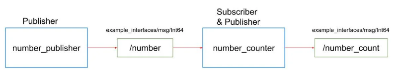

# Activity 1 — ROS 2 Topics

## Overview

This activity demonstrates **basic ROS 2 communication using topics** by creating two Python nodes:

- **Node 1: `number_publisher`**  
  Publishes an increasing counter on **`/number`** every 1 second.

- **Node 2: `number_counter`** (subscriber + publisher)  
  Subscribes to **`/number`** and republishes the received value on **`/number_count`**.

Conceptually:


Next, we implement the nodes in code. We begin with the publisher (`number_publisher`).

---

## Code

1. Publisher node

```python
#!/usr/bin/env python3

import rclpy
from rclpy.node import Node
from example_interfaces.msg import String

class MyPublisher(Node):
    def __init__(self):
        super().__init__("number_publisher")
        self.cnt = 0
        self.get_logger().info("number_publisher is alive")
        self.create_timer(1.0, self.talk)
        self.publisher_ = self.create_publisher(String, "number", 10)

    def talk(self):
        msg = String()
        msg.data = str(self.cnt)
        self.cnt += 1
        self.get_logger().info("I said: " + msg.data)
        self.publisher_.publish(msg)

def main(args=None):
    rclpy.init(args=args)
    number_publisher = MyPublisher()
    rclpy.spin(number_publisher)
    rclpy.shutdown()

if __name__ == "__main__":
    main()
```

The code creates a publisher (`number_publisher`)  that sends a counter value on the `/number` topic using `example_interfaces/String`. A timer calls `talk()` once per second, where the message is filled with the current counter, logged, published, and then incremented. The `main()` function initializes ROS 2, keeps the node running with `rclpy.spin()`.

2. Publisher and subscriber node

```python
#!/usr/bin/env python3

import rclpy
from rclpy.node import Node
from example_interfaces.msg import String

class MyPublisher(Node):
    def __init__(self):
        super().__init__("number_counter")
        self.cnt = 0
        self.get_logger().info("number_counter is alive")
        self.create_timer(1.0, self.talk)
        self.publisher_ = self.create_publisher(String, "number_count", 10)
        self.subscriber = self.create_subscription(String,"number", self.listen, 10)

    def listen(self, msg: String):
        self.get_logger().info(msg.data) #print the data field
        self.cnt = int(msg.data)

    def talk(self):
        msg = String()
        msg.data = str(self.cnt)
        self.get_logger().info("number_publisher is saying: " + msg.data)
        self.publisher_.publish(msg)
            

def main(args=None):
    rclpy.init(args=args)   
    number_counter = MyPublisher()
    rclpy.spin(number_counter) 
    rclpy.shutdown()

if __name__ == "__main__":
    main()
```

The second node (`number_counter`) completes the pipeline by **subscribing** to the `/number` topic published by `number_publisher` and then **republishing** the received value on `/number_count`.

```python
    def listen(self, msg: String):
        self.get_logger().info(msg.data) #print the data field
        self.cnt = int(msg.data)
```

The `listen()` callback runs every time a message arrives on `/number`, logs the incoming data, and **stores** it in `self.cnt` (converted back to an integer).

```python
    def talk(self):
        msg = String()
        msg.data = str(self.cnt)
        self.get_logger().info("number_publisher is saying: " + msg.data)
        self.publisher_.publish(msg)
```

A timer calls `talk()` once per second to publish the current stored value to `/number_count`, allowing other nodes (or `ros2 topic echo`) to read the forwarded counter. As before, `main()` initializes ROS 2, keeps the node running with `rclpy.spin()`, and shuts down cleanly.

---
## Results (Terminal and rqt_graph)


