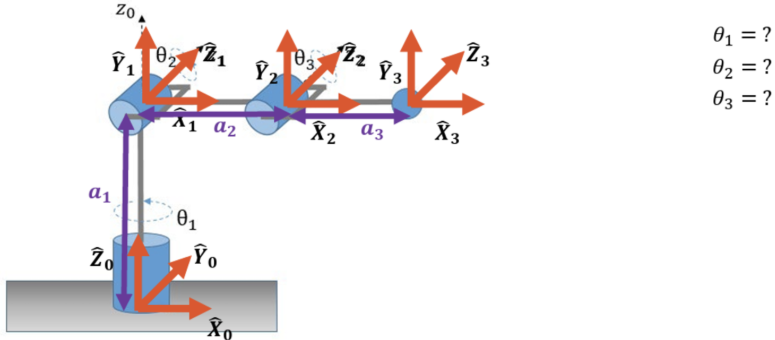
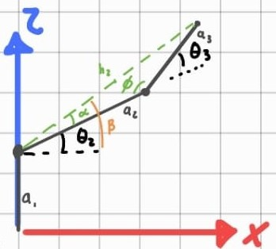
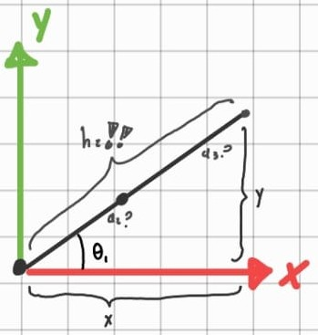

# IK and jacobian

## 1. Overview

This section presents the inverse kinematic analysis of the manipulator and the derivation of the Jacobian from the end-effector position equations.

First, the geometric relationships used to obtain the inverse kinematics equations are introduced. Then, the homogeneous transformations are developed to obtain the complete forward kinematic model \(T_0^3\). Finally, the position vector of the end-effector is extracted and differentiated with respect to the joint variables in order to construct the linear Jacobian.

---

## 2. Inverse Kinematics Equations, Lateral view (xz plane)

For this analysis, the initial pose of the robot was adjusted to facilitate the determination of the corresponding joint angles. In this view, the inverse kinematic formulation is centered on \(q_2\) and \(q_3\), as these joint variables govern the geometric configuration of the manipulator in the \(x\)-\(z\) plane.

The joint angle equations are obtained as functions of the target coordinates \((x, z)\).

### 2.1 \(\theta_2\) and \(\theta_3\) definition

$$
\beta = \alpha + \theta_2
\;\;\therefore\;\;
\theta_2 = \beta - \alpha
$$

$$
180^\circ = \phi + \theta_3
\;\;\therefore\;\;
\theta_3 = 180^\circ - \phi
$$

Therefore, the variables $\alpha$, $\beta$, and $\phi$, previously defined, must be known in advance in order to determine the inverse kinematics of $\theta_2$ and $\theta_3$.

---

### 2.2 Calculation of the intermediate variable \(h_z\)

The variable \(h_z\) must be obtained first because it defines the side of the triangle formed in the \(x\)-\(z\) plane by the links \(a_2\), \(a_3\), and the target position. It is required to apply the law of cosines and compute the auxiliary angles \(\alpha\) and \(\phi\), which are then used to determine \(\theta_2\) and \(\theta_3\).

From the geometric analysis of the manipulator, the following relationship for \(h_z\) is obtained:

$$
h_z^2 = x^2 + (z - a_1)^2
$$

Thus, the magnitude of \(h_z\) is:

$$
h_z = \sqrt{x^2 + (z - a_1)^2}
$$

---

### 2.3 Calculation of the Angle \(\beta\)

From the manipulator geometry, the angle \(\beta\) is determined using the inverse tangent function:

$$
\beta = \tan^{-1} \left( \frac{z - a_1}{x} \right)
$$

---

### 2.4 Law of Cosines for \(\phi\)

To determine the internal angle \(\phi\) of the triangle formed by the robot links, the law of cosines is applied:

$$
h_z^2 = a_2^2 + a_3^2 - 2a_2 a_3 \cos(\phi)
$$

Solving for \(\phi\), the following expression is obtained:

$$
\phi = \cos^{-1} \left( \frac{-h_z^2 + a_2^2 + a_3^2}{2 a_2 a_3} \right)
$$

---

### 2.5 Calculation of the Angle \(\alpha\)

Applying the law of cosines again to the robot arm triangle, the following relationship for side \(a_3\) is obtained:

$$
a_3^2 = a_2^2 + h_z^2 - 2a_2 h_z \cos(\alpha)
$$

The angle \(\alpha\) is then computed as:

$$
\alpha = \cos^{-1} \left( \frac{-a_3^2 + a_2^2 + h_z^2}{2 a_2 h_z} \right)
$$

---

## 3. Inverse Kinematics Equations, Top view (xy plane)

For this analysis, the initial pose of the robot was adjusted to facilitate the determination of the corresponding joint angles. In this view, the inverse kinematic formulation is centered on \(q_1\), as these joint variables govern the geometric configuration of the manipulator in the \(x\)-\(y\) plane.

From the geometric relationship between the Cartesian coordinates \((x,y)\) and the projected radial distance, \(\theta_1\) is obtained as

$$
\theta_1 = \tan^{-1}\left(\frac{y}{x}\right)
$$

---

## Joint Angle Equations

For the angle \(\theta_1\):

$$
\theta_1 = \tan^{-1}\left(\frac{y}{x}\right)
$$

For the angle \(\theta_2\):

$$
\theta_2 = \tan^{-1} \left( \frac{z - a_1}{x} \right) - \cos^{-1} \left( \frac{-a_3^2 + a_2^2 + h_z^2}{2 a_2 h_z} \right)
$$

For the angle \(\theta_3\):

$$
\theta_3 = 180^\circ - \cos^{-1} \left( \frac{-h_z^2 + a_2^2 + a_3^2}{2 a_2 a_3} \right)
$$

---

## 4. Determination of the Robot Jacobian

### 4.1 Notes

To simplify the trigonometric expressions used in the matrices and in the Jacobian, the following notation is adopted:

$$
c_1 = \cos(q_1), \qquad c_2 = \cos(q_2), \qquad c_3 = \cos(q_3)
$$

$$
s_1 = \sin(q_1), \qquad s_2 = \sin(q_2), \qquad s_3 = \sin(q_3)
$$

### 4.2 Homogeneous Matrix Multiplication (End effector)

The product corresponding to the homogeneous transformation matrices of the first two links is:

$$
T_0^1 \cdot T_1^2 = 
\begin{pmatrix}
\cos(q_1) & 0 & -\sin(q_1) & 0 \\
\sin(q_1) & 0 & \cos(q_1) & 0 \\
0 & -1 & 0 & a_1 \\
0 & 0 & 0 & 1
\end{pmatrix}
\cdot
\begin{pmatrix}
\cos(q_2) & -\sin(q_2) & 0 & a_2\cos(q_2) \\
\sin(q_2) & \cos(q_2) & 0 & a_2\sin(q_2) \\
0 & 0 & 1 & 0 \\
0 & 0 & 0 & 1
\end{pmatrix}
$$

The resulting matrix from the product \(T_0^1 \cdot T_1^2\) is:

$$
T_0^2 = 
\begin{pmatrix}
\cos(q_1)\cos(q_2) & -\cos(q_1)\sin(q_2) & -\sin(q_1) & a_2\cos(q_1)\cos(q_2) \\
\sin(q_1)\cos(q_2) & -\sin(q_1)\sin(q_2) & \cos(q_1) & a_2\sin(q_1)\cos(q_2) \\
-\sin(q_2) & -\cos(q_2) & 0 & -a_2\sin(q_2) + a_1 \\
0 & 0 & 0 & 1
\end{pmatrix}
$$

The intermediate matrix \(T_0^2\) is multiplied by the transformation matrix \(T_2^3\):

$$
T_0^2 T_2^3 =
\begin{bmatrix}
\cos(q_1)\cos(q_2) & -\cos(q_1)\sin(q_2) & -\sin(q_1) & a_2\cos(q_1)\cos(q_2) \\
\sin(q_1)\cos(q_2) & -\sin(q_1)\sin(q_2) & \cos(q_1) & a_2\sin(q_1)\cos(q_2) \\
-\sin(q_2) & -\cos(q_2) & 0 & -a_2\sin(q_2) + a_1 \\
0 & 0 & 0 & 1
\end{bmatrix}
\;
\begin{bmatrix}
\cos(q_3) & -\sin(q_3) & 0 & a_3\cos(q_3) \\
\sin(q_3) & \cos(q_3) & 0 & a_3\sin(q_3) \\
0 & 0 & 1 & 0 \\
0 & 0 & 0 & 1
\end{bmatrix}
$$

The resulting matrix, which represents the position and orientation of the end-effector with respect to the base frame, is:

$$
T_0^3 = 
\begin{bmatrix}
\cos(q_1)\cos(q_2)\cos(q_3) - \cos(q_1)\sin(q_2)\sin(q_3) & -\sin(q_2+q_3)\cos(q_1) & -\sin(q_1) & a_3\cos(q_1)\cos(q_2)\cos(q_3) + a_2\cos(q_1)\cos(q_2) - a_3\cos(q_1)\sin(q_2)\sin(q_3) \\
\cos(q_2+q_3)\sin(q_1) & -\sin(q_2+q_3)\sin(q_1) & \cos(q_1) & a_3\cos(q_1)\cos(q_2)\cos(q_3) + a_2\sin(q_1)\cos(q_2) - a_3\sin(q_1) \\
-\sin(q_2)\cos(q_3) - \cos(q_2)\sin(q_3) & -\cos(q_2+q_3) & 0 & -a_3\sin(q_2)\cos(q_3) - a_3\cos(q_2)\sin(q_3) - a_2\sin(q_2) + a_1 \\
0 & 0 & 0 & 1
\end{bmatrix}
$$

From the last column of matrix \(T_0^3\), the position vector of the end-effector is obtained as:

$$
P =
\begin{bmatrix}
a_3(c_1)(c_2)(c_3)+a_2(c_1)(c_2)-a_3(c_1)(s_2)(s_3) \\
a_3(s_1)(c_2)(c_3)+a_2(s_1)(c_2)-a_3(s_1)(s_2)(s_3) \\
-a_3(s_2)(c_3)-a_3(c_2)(s_3)-a_2(s_2)+a_1
\end{bmatrix}
$$

---

## Jacobian Matrix

Differentiating the position vector with respect to the joint variables \(q_1\), \(q_2\), and \(q_3\), the linear Jacobian \(J_v\) is obtained:

$$
J_v =
\begin{bmatrix}
-a_3(s_1)(c_2)(c_3)-a_2(s_1)(c_2)+a_3(s_1)(s_2)(s_3) &
-a_3(c_1)(s_2)(c_3)-a_2(c_1)(s_2)-a_3(c_1)(c_2)(s_3) &
-a_3(c_1)(c_2)(s_3)-a_3(c_1)(s_2)(c_3)
\\
a_3(c_1)(c_2)(c_3)+a_2(c_1)(c_2)-a_3(c_1)(s_2)(s_3) &
-a_3(s_1)(s_2)(c_3)-a_2(s_1)(s_2)-a_3(s_1)(c_2)(s_3) &
-a_3(s_1)(c_2)(s_3)-a_3(s_1)(s_2)(c_3)
\\
0 &
-a_3(c_2)(c_3)+a_3(s_2)(s_3)-a_2(c_2) &
a_3(s_2)(s_3)-a_3(c_2)(c_3)
\end{bmatrix}
$$

Each column of this matrix represents the contribution of one joint variable to the variation of the end-effector position.